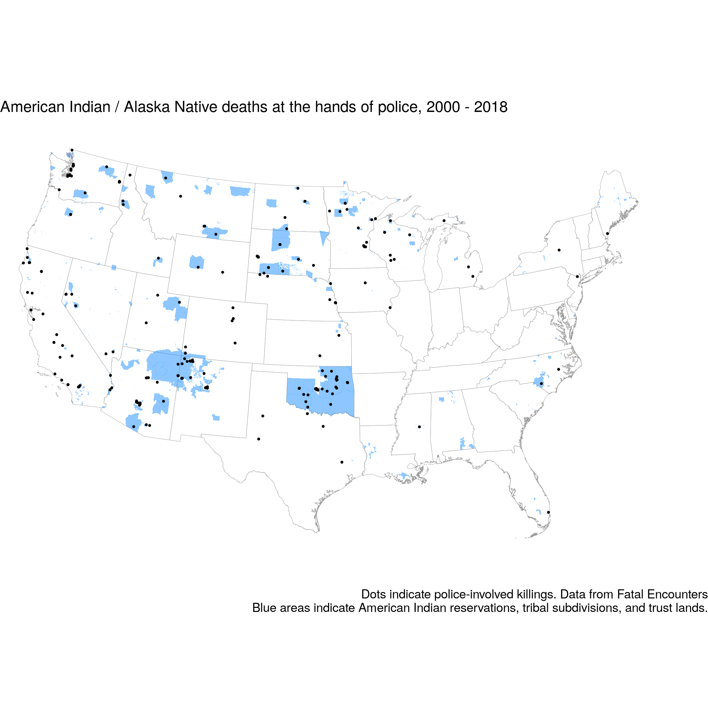
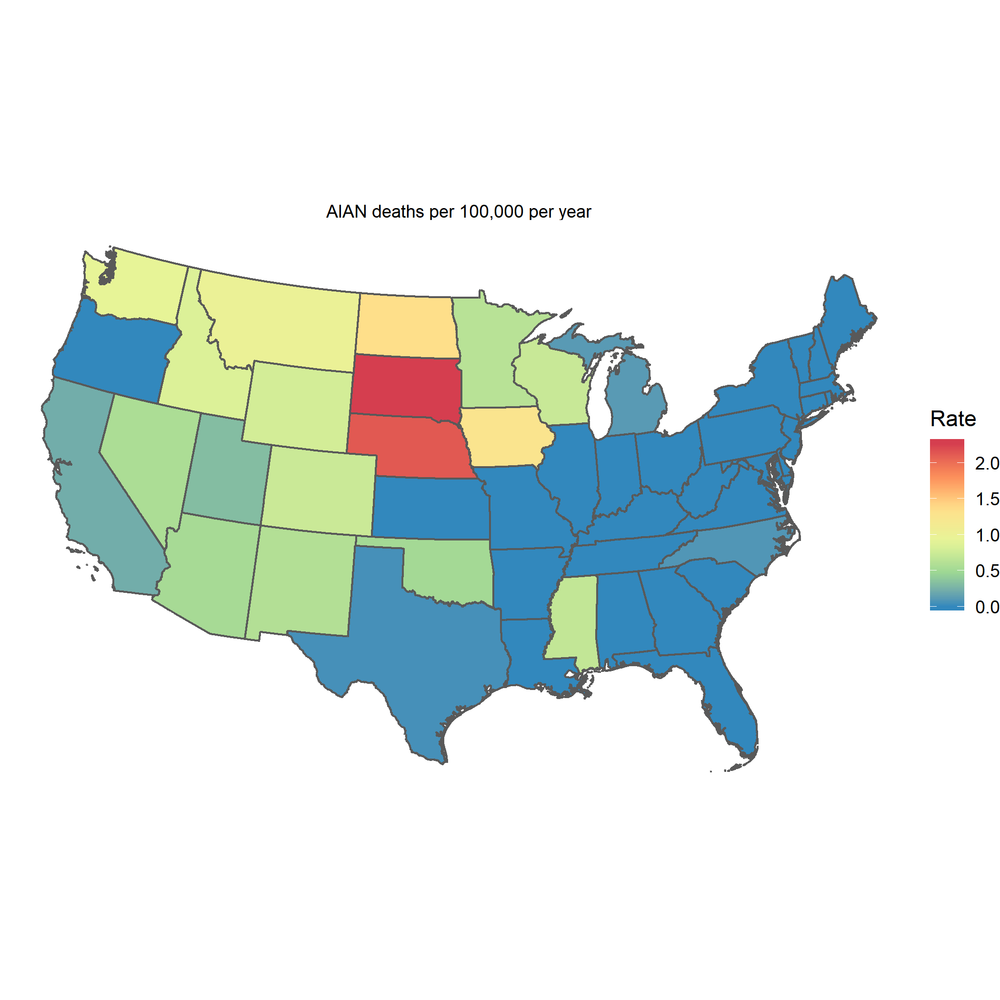
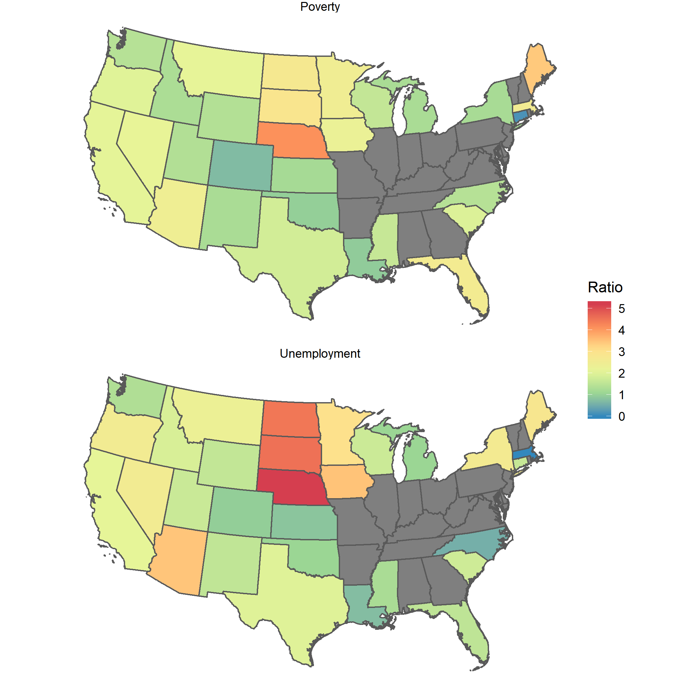
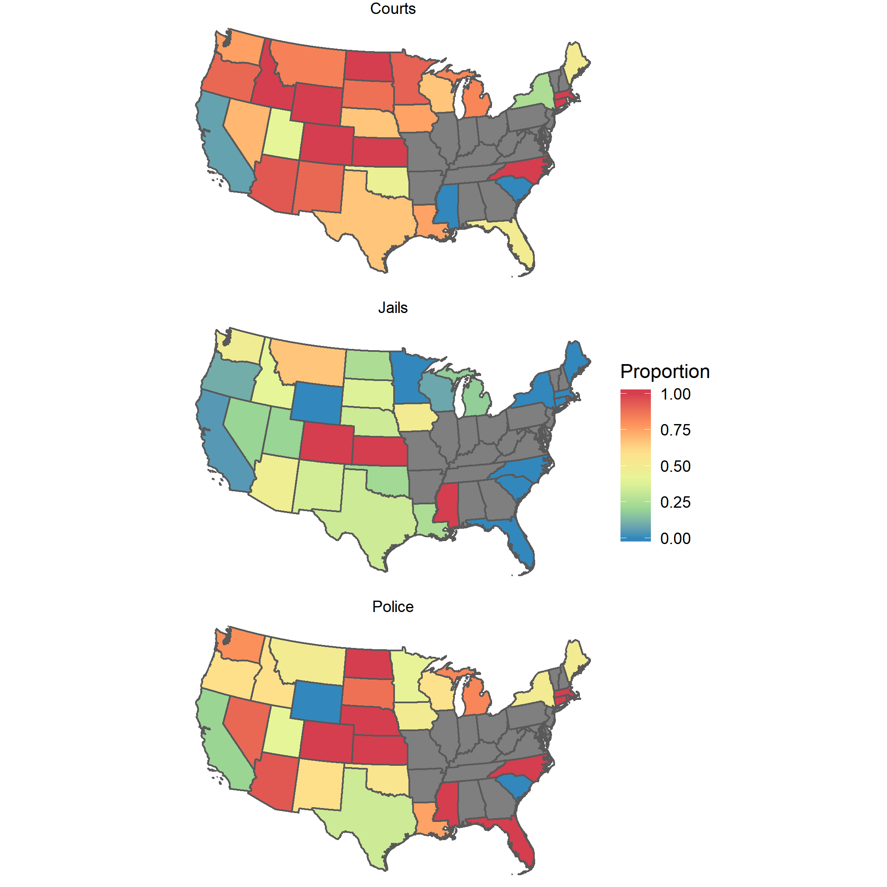
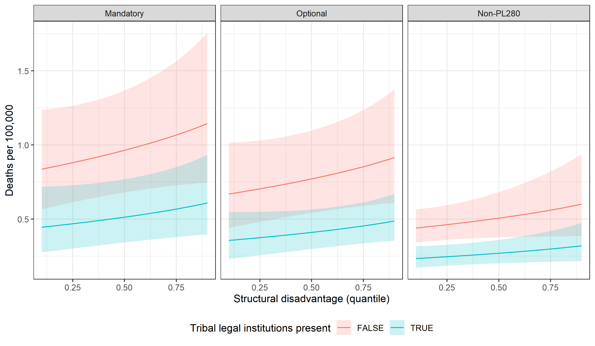
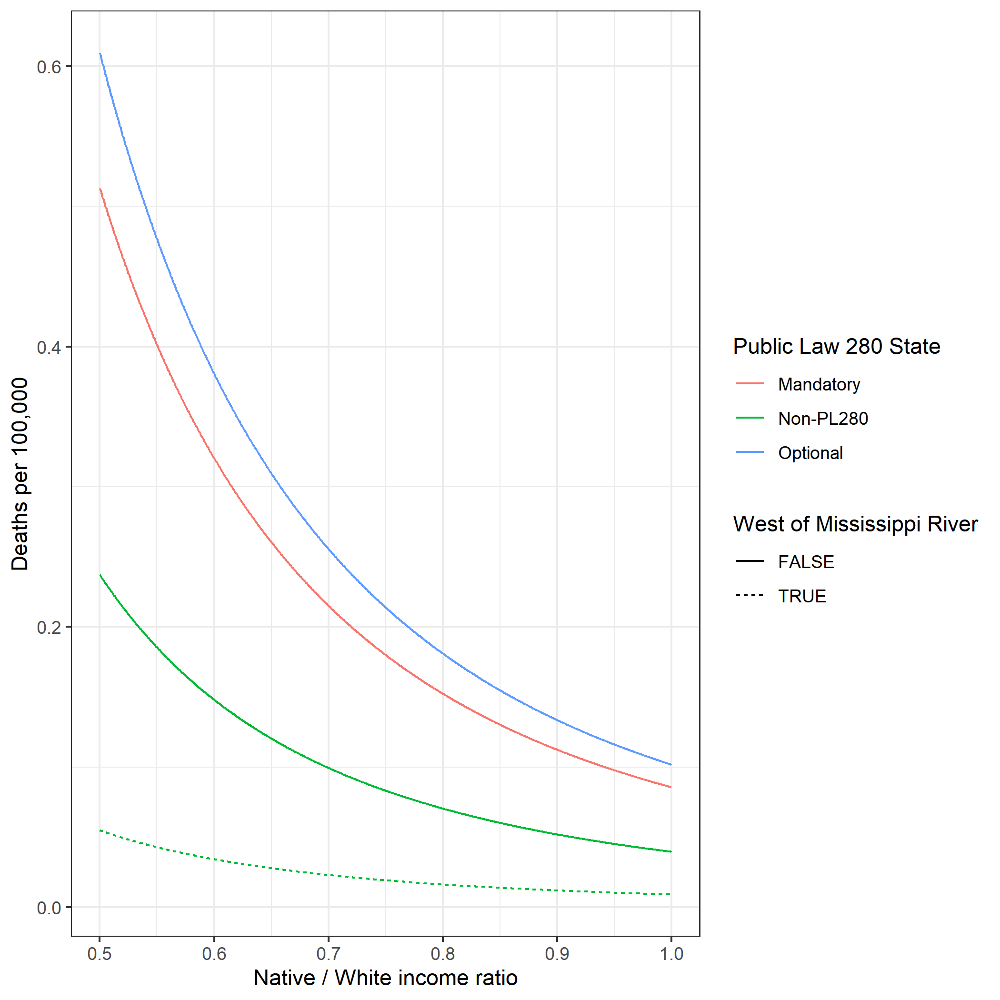

## Introduction
 
Police violence against American Indians, along with other forms of state coercion such as child removal, can be interpreted as a legacy and continuation of colonial violence. In this paper, we evaluate how the subordination of tribal governments to federal, state, and local law enforcement is related to rates at which Native people are killed by police. We also evaluate whether tribal sovereignty, in the form of autonomous legal institutions, acts as a shield to protect Native people from police violence.

Between 2000 and 2018, 23,574 people died during a law enforcement encounter in the United States. American Indian and Alaska Natives are at higher risk of being killed by police than is the general population. American Indian men face a lifetime risk of being killed by police of about 60 per 100,000 compared to a lifetime risk of about 40 per 100,000 for white men. Native women face a lifetime risk of being killed by police of about 4 per 100,000, about double the rate at which white women are killed by police (Edwards et al., forthcoming).

Although rarely reported in mainstream media, fatal interactions with law enforcement are fairly common for this population. News of two high-profile police killings in recent years – Loreal Tsingine (Diné) in Winslow, Arizona in 2016 (Lartey 2016) and John T. Williams (Nuu-Chah-Nulth First Nations) in Seattle, Washington in 2010 (Miletich 2010) – circulated widely throughout Indian Country, yet these incidents were barely a blip on the mainstream media’s radar. Thus far, little social scientific research explores the frequency of these police killings and the significance that historical, place-based legal structures such as federal Indian law and tribal sovereignty might play in predicting the distribution of, and attention to, these events.

In this project we map and describe the contemporary distribution of this form of state violence – the death of American Indians at the hands of law enforcement – and explore whether the unique political status of tribal nations may help to account for the prevalence of this enduring social phenomenon in distinct geographic locations such as tribal lands, reservation border towns, and urban centers. We begin with a brief description of the legal status of tribal nations – “as domestic dependent nations” – which has a significant impact on the relationship between tribes and law enforcement.

To this end, we focus our attention on the role that federal surveillance and state violence played throughout the nation’s beginnings and its westward expansion, and how agents of empire – social actors that today we might rightfully call local, state, and federal law enforcement officers – intervened into the lives of American Indians through treaty-making, assimilation programs, and land allotment. We then evaluate how this criminal justice legacy has imprinted upon the lives of everyday Native Peoples and their federally recognized land bases today by evaluating the spatial distribution of deaths of American Indians at the hands of law enforcement. We use novel data on police-involved killings to identify where Native people are most likely to be killed by police and evaluate how structural inequality and tribal sovereignty drive risk.

We use the political history of tribal nations to track the relationship between law enforcement and Native Peoples for several reasons. First, although commonly framed as a racial and ethnic group in social scientific studies, American Indians have a distinct political status that enables federally recognized tribal nations to engage in a nation-to-nation relationship with the U.S. federal government. As a result, the sociological study of these communities must better account for this defining political dimension of group status. Second, we approach the study of police killings as one form of state violence that is located in the historical trajectory of Native displacement, a framing that might account for the disappearance of this violence from public view. Third, we emphasize that contemporary forms of state violence originate within the complex histories of territory that often go unseen or understudied. In the case of American Indians, these territorial histories are rooted in the inherent sovereign authority of Native Peoples to govern their land, people, and resources.

## Native nationhood and law enforcement

Currently, there are 573 federally recognized American Indian nations Alaska Native tribes living within the borders of the United States (U.S. Federal Register 2018). Many more tribal communities are not formally recognized by the federal government, but maintain their cultural and political life, often with state-recognition. Federal recognition acknowledges the nation-to-nation political relationship between the U.S. federal government and an Indian tribe, and in most cases, solidifies a tribal nation’s legal eligibility for federal programs. Federal recognition also formalizes a tribal community’s inherent rights and jurisdiction over a defined area of land, people, and resources. With this political power, the tribal sovereign can pursue efforts to promote the will, safety, and well-being of its people.

The existence of Native nationhood, and its powerful role in the history of global trade and diplomacy, was internationally recognized in early America (Champagne 2008). As a result, colonists established numerous treaties with the tribal nations, a practice that continued on for several centuries. Less well understood is the role of law enforcement in shaping the relationship between Native nations and the political process of treaty-making. As a mechanism of federal surveillance, treaties strictly policed geographic and social boundaries between American Indians and early colonists. As the U.S. grew in power and size, the federal government feared that tribal nations would continue to build political alliances with other foreign nations, potentially threatening American control over valuable lands, resources, and even nationhood itself. In turn, the U.S. sought to limit the tribes’ ability to build such relationships by expanding U.S. control over every day social life in Indian Country.

The Supreme Court aided in these objectives by restructuring internationally recognized sovereign tribal nations into “domestic dependent nations” (8 Wheat 1823) – legal wards of the federal government that exist under a unique and subordinate form of sovereignty. Under this diminished political status, tribal nations must rely on the federal government for protection and approval of most external governmental affairs. This legal classification permanently positioned tribes as subject to the dual but contradictory federal apparatuses of surveillance and protection. Questions arose immediately about whether and when tribal, local, state, and federal jurisdiction would govern several issues, especially civil and criminal matters involving Natives on tribal lands (29th Congress, 1st Session 1846). In time, the ambiguity of this “jurisdictional maze” seeped into the relationship between Native Peoples and law enforcement as Indian agents sought to adjudicate disputes between Indians on tribal lands using either state or federal law. Without Congressional approval or Constitutional support, Indian agents arrested and imprisoned tribal members, challenging the authority of tribal legal systems and expanding control over Native bodies using the threat of state violence (Ex Parte Crow Dog 1883; Major Crimes Act 1885). We know little about how the expansion and distribution of place-based surveillance continues to impact the day-to-day experiences of American Indians with contemporary law enforcement.

 
### Historical Encounters with Law Enforcement

The U.S. Supreme Court justified the transformation of tribal nations into “domestic dependent nations” by applying the “Doctrine of Discovery” to Native Peoples and lands. The Doctrine’s ideology – “that normatively divergent ‘savage’ peoples could be denied rights and status equal to those accorded to the civilized nations of nations of Europe” (Williams 1986) – significantly impacted the relationship between tribes and agents of empire (law enforcement). Using the legal force of this colonial justification for state violence, federal law enforcement officers intervened into the lives of American Indians with federal programs that constrained the mobility of Native Peoples. Treaties and Trade and Intercourse Acts established the basis for this intervention, growing in time to include assimilationist programs – such as boarding schools and land allotment under the Dawes Act of 1887 – as tributary powers over the tribes. As the two primary methods of legal boundary-making in early America, Treaties and Intercourse Acts sought to control the passage of people, trade goods, and social relationship between tribal nations and neighboring non-Natives. The presence of law enforcement officers was common in the creation and enforcement of these boundary-making practices; the act of American treaty-making, for example, regularly involved military commanders from nearby military forts (Deloria and DeMallie 1999). The Intercourse Acts also established the basis for federal jurisdiction over crime, punishment, and legal decision-making in Indian Country.

Formal treaty-making ended in 1871, yet in the decades prior, the legacy of boundary-making and subordination between tribal nations and non-Natives persisted in the form of geographic removal and physical containment into reservations. For example, the Indian Removal Act of 1830 sought to forcibly remove tribal communities west of the Mississippi River in order to open up property rights of tribal lands and natural resources to White settlers. Quickly thereafter, the federal government created reservations and pushed tribal communities onto federally defined land bases, sometimes thousands of miles away from a tribe’s homeland – places from which tribal epistemologies and identity are explicitly derived (Tsosie 2003; Liebler 2010). In these mostly rural spaces, a series of federal programs were used to further separate Native Peoples from their language, culture, and unique form of political self-governance – extending assimilationist logics that increased opportunities for non-Natives and law enforcement officers to intervene in daily life. As a result, surveillance and control also included the managers of reservation assimilation programs, the architects of Indian land allotment, and the religious and “welfare” organizations that facilitated Native assimilation in boarding schools around the nation. Each of these federal acts required law enforcement agents to physically remove and contain tribal nations using coercive and excessive force. In addition, these acts increased the potential for unmanaged friction and violence between populations – an important legacy that may help to account for the frequency and distribution of violence for Native Peoples at the hands of law enforcement today.

### Contemporary Encounters with Law Enforcement

American Indians routinely experience violence at the hands of federal, state, and local US agencies and are at particularly high risk of being killed by law enforcement. Treaty-making and the assimilationist programs of removal and allotment laid the groundwork for future state violence among this population. A third historical place-based phenomenon – criminal and civil jurisdiction over Native Peoples – transitioned historical Native encounters with law enforcement into contemporary jurisdictional tensions over the physical and geographic control of Native Peoples. Jurisdictional tension persisted long after treaty-making and formal assimilationist programs came to an end, and likely transformed the intensity and distribution of this tension into anti-Indian bias along high-contact zones including tribal reservations, reservation border towns, and urban spaces.

To better understand the significance of jurisdiction as a contemporary mechanism of federal surveillance and social control, we briefly consider the impact of two Termination Era federal Indian policies – Public Law 280 and the American Indian Urban Relocation Program. Both engage the legal and social implications of jurisdiction by highlighting the possibilities for friction along Native and non-Native boundaries. This is especially true in geographic locations in which civil and criminal jurisdiction is “shared” among diverse law enforcement agencies (tribal, local, state, and federal).

The Termination Era was guided by a Congressional desire to accelerate the assimilation of Native Peoples and, in doing so, to relinquish federal responsibility of countless treaty agreements. It was believed that assimilation efforts “to make the Indian child a better American” (Friends of the Indians XX) would increase the avenues by which Native communities could be absorbed by popular society. In turn, these actions would reduce reducing the recognizability and vitality of tribal communities and justify the end of federal political and financial responsibilities to tribal nations. 

In 1953, Congress passed Public Law 280 (PL 280) which authorized states to exercise jurisdiction over tribal members and tribal communities in Indian Country. While this practice had operated across the nation for at least a half century prior, PL 280 provided a “comprehensive regime for empowering states on reservations” (Goldberg 1997). The law created a two-tier system of jurisdictional changes, granting one set of states (six) with criminal and civil jurisdiction over matters arising in Indian Country. The second set of states (all others) were permitted to pass legislation to assume this jurisdiction if desired. The law was amended in 1968 but did not offer tribes the opportunity to have state jurisdiction rolled back (Goldberg 1997).

In 1954, Senator Arthur Watkins of Utah declared that “The sooner we get the Indians into cities the sooner the government can get out of the Indian business” (83rd Congress, 2d Session 1954). Between 1953 and 1960, approximately 33,000 Native Peoples were relocated from their tribal communities to urban centers. Many more would make the transition in the decade that followed. By 1970, the urban Indian population surpassed that of rural Indian communities, increasing the visibility of Native Peoples in the broader American society (Neils 1971; Burt 1986). Relocated tribal members were ill-prepared by the Bureau of Indian Affairs and struggled with discrimination, poverty, and cultural shifts in social life. In addition, the work that was promised was low-wage and housing options were often limited to low-income areas. Troublesome encounters with law enforcement were quite common, in effect, extending state and local criminal jurisdiction over Native Peoples who just previously were under tribal and federal jurisdiction on their reservation lands.

Building from this long political history between tribal nations and the federal government, we hypothesize that place – by which we mean literal geographic location – impacts the potential for fatality by law enforcement. More specifically, we assert that the histories of state violence and social control in Indian Country impact contemporary lived experiences, and in the process, can potentially predict the outcomes for Native Peoples at the interaction zone that is the police-citizen encounter. We anticipate four outcomes related to the frequency and distribution of these deaths.

Colonial treaty-making, tribal land dispossession, and Indian removal began along the Atlantic coast and rapidly moved Native Peoples west. The primary desire was to remove tribal nations from desirable lands in the east. The use of force by federal agents was commonplace in accomplishing this goal. We hypothesize that this coercive history plays a defining role in how tribal nations continue to engage with law enforcement west of the Mississippi River.

Throughout the late 1700s and early 1800s, federal officials believed that American Indians would either vanish or assimilate under the will of the expanding American nation. When this proved not to be the case, federal policy was prepared to intervene with force. An 1819 House Report regarding funding for civilization and assimilation programs confirms this position. It reads: “In the present state of our country one of two things seems to be necessary. Either that those sons of the forest should be moralized or exterminated” (CITATION HERE). We hypothesize that this assumption of American Indian subordination continues to inform how state agents engage with this population in high-contact zones.

We suggest that Native death by law enforcement will occur more often in geographic locations most impacted by Termination Era federal Indian policy (1947-1961). Two products of this era stand out – Public Law 280 and the American Indian Urban Relocation Program – because of their distinct role in expanding law enforcement jurisdiction over Native Peoples.

PL 280 complicated tribal-state relations and strained tribal legal systems. Due to the tribes’ active resistance against this unwanted jurisdictional sharing, we anticipate that in these states (Alaska, California, Minnesota, Nebraska, Oregon, and Wisconsin), violent encounters with law enforcement will be more frequent. Similarly, we anticipate that those urban spaces, which received tribal members during the American Indian Urban Relocation Program more frequently than others (FUTURE REVISIONS WILL ANALYTICALLY ADDRESS URBAN RELOCATION), continue to experience higher than average fatal encounters.

## Analytic strategy

We evaluate how American Indians’ risk of being killed by police varies across states and tribal lands. We use population, police killing, and surveys of tribal governments to systematically evaluate how a) state and local criminal jurisdiction, b) proximity to the Mississippi River (WILL BE MEASURED AS DISTANCE IN FUTURE REVISIONS), c) the presence or absence of tribal legal institutions, and d) structural inequalities are related to rates at which Native people are killed by state and by tribal home land (reservations, trust lands, and other American Indian lands). We provide a series of descriptions of the distributions of these measures, followed by regression models that evaluate how rates of death are related to sovereignty, jurisdiction, geography, and disadvantage.

Because Alaskan and Hawaiian native lands are subject to different bodies of law, we restrict this analysis to the lower 48 US states.

Future revisions will include additional criminal justice outcomes, including arrests and incarceration obtained through the Uniform Crime Reports and National Corrections Reporting Program. We will also extend this analysis to include analysis of family separations through the child welfare system using data from the Adoption and Foster Care Analysis and Reporting System.
We appreciate the discussant’s willingness to review this work-in-progress.

## Data

This paper relies on three sources of data. Data on police-involved killings are provided by Fatal Encounters (FE). Fatal Encounters collects information on all deaths involving police across the US, with the exception of deaths that occur after a person has been booked into a jail or other detention facility. FE researchers identify cases from systematic searches of online news coverage and public records. Researchers code the characteristics of individuals, such as race/ethnicity, age, sex, and cause of death based on news reporting, social media profiles, and obituaries. They also provide the reported location of death. Note that there is a substantial volume of missing data on the race of the deceased. This missingness is most pronounced between 2000 and 2012; the levels of missing data range between 5 and 15 percent in more recent years.

In future work on this project, our team will systematically re-code the race/ethnicity of all cases occurring on or near native land and will develop imputation models to estimate victim race for all missing cases.

We use 2000 - 2019 data on deaths occurring on tribal lands, matched by merging FE with US Census American Indian home land shape files. We identify 87 deaths with a victim identified as American Indian occurring on tribal lands over this time period. For states, we restrict our analysis to 2013 - 2018 (where race/ethnicity data are of higher quality in FE) and estimate state-year regression models of counts of police-involved deaths of American Indians. Over this 6-year period, FE identifies 108 deaths of Native people.

We use the spatial coordinates provided by Fatal Encounters to identify deaths occurring on or near American Indian homelands using the Census American Indian homeland shapefiles. This shapefile identifies federally recognized American Indian reservations and off-reservation trust land areas and state-recognized American Indian reservations. It also includes information on Oklahoma tribal statistical areas, tribal designated statistical areas, and state designated tribal statistical areas. We link FE cases to these lands, and also include information on a series of demographic measures from the American Community Survey (ACS) 2013 - 2017 5-year data for each of these tribal lands, obtained via NHGIS (CITATION). We use the ACS to construct ratios of population well-being for tribal lands relative to full state populations to compare population conditions in Indian Country to state averages for each state with tribal land.

Information on tribal legal institutions is obtained from the Census of Tribal Justice Agencies. This 2002 dataset provides detailed descriptions of tribal law enforcement and tribal court systems. It provides the most comprehensive systematic data on tribal legal infrastructure currently available. In the 2002 wave, 314 of the 341 federally recognized American Indian tribes in the lower 48 US states participated in this census. We manually match these tribal government-level data to American Indian lands provided in Census shape files.

PL 280 mandated that state and local law enforcement had jurisdiction over cases on Indian territory for six states: California, Minnesota, Nebraska, Oregon, Wisconsin, and Alaska. 10 more states opted into the provisions in full or in part: Nevada, Florida, Idaho, Iowa, Washington, South Dakota, Montana, North Dakota, Arizona, and Utah. We include a three-value variable to indicate PL 280 status: mandatory, optional and non-PL 280. This measure provides a direct measure of the freedom that state and local law enforcement have to act on tribal lands.

We include the following binary variables to measure tribal legal institutions: tribe has a law enforcement agency with arrest powers; tribal law enforcement officers are recognized by the state and have state peace officer authority; tribal government operates a detention facility (jail); juvenile offenses are referred to tribal authorities; tribe has a court system. We also include a three-value variable that indicates whether a tribe is in a mandatory, optional, or non-PL280 state. We treat these data as providing proxies of the magnitude of jurisdictional sovereignty American Indian tribal governments are able to exercise in their communities and in relation to agents of empire (US federal, state, and local law enforcement).

Note that a new wave of this data has been fielded by the Bureau of Justice Statistics and is expected to be released by the end of 2019. Future revisions of this analysis will include these updated data.
 
## Methods

We describe and evaluate the distribution of American Indian police killings, and the relationship between Indian Country and police violence. First, we explore the spatial distribution of police killings of American Indians and structural disadvantage of American Indians. Next we describe the spatial distribution of tribal government legal institutions (as of 2002) to crudely describe variation in tribal sovereignty in matters of law enforcement and criminal justice. We also provide descriptions of the kinds of law enforcement agencies (federal, state, local, tribal) involved in police killings of American Indians on or near Indian land.

Next we evaluate the relationships between tribal criminal justice jurisdiction and legal infrastructure, structural disadvantage of American Indians, and police killings of American Indians. We construct a series of count models to estimate these relationships, then visualize the predicted relationships between tribal sovereignty, structural disadvantage, and rates of police killings for tribal lands and states.

## Findings

### Police killings of American Indians

Between 2000 and 2018, Fatal Encounters recorded 209 police-involved non-suicide deaths of American Indians and Alaska Natives in the lower 48 states of the US. We show the distribution of these killings across states and tribal lands in Figure F1. Of these, 87 (42 percent) occurred on tribal lands. A large remainder of the deaths recorded in FE occurred near tribal land, or in cities with large populations of American Indians. Future analyses will identify deaths occuring at the interstices of US and tribal land and deaths occurring in cities that were host to large numbers of American Indians during the termination era. 

Figure F2 displays the rates of police involved killing of American Indians per 100,000 person-years across the lower 48 US States. States West of the Mississippi River tend to have higher rates of police-involved killings of American Indians that do states East of the Mississippi. South Dakota has the highest rate of killings in the country, though Nebraska, North Dakota, and Iowa also have exceptionally high rates of police-involved killings of Native people as well. 

### The distribution of structural disadvantage and inequality in Indian Country

Figure F3 displays inequality between persons living in American Indian homelands and persons living in the states. In the average state there are 1.8 times more poor people per capita living on American Indian homelands than in the state as a whole. Poverty is more common on American Indian homelands than in the state in all but 4 of the 30 states in the lower 48 that have federally recognized tribal lands. The average ratio of unemployment rates on tribal lands to state unemployment rates is 2.1. Unemployment is higher on tribal lands in 83 percent of states. 

### The distribution of tribal legal institutions

Figure F4 displays the proportion of tribal governments that reported operating various classes of legal institutions on the 2002 Census of Tribal Justice Agencies. Among the 92 percent of tribal governments $(n = 322)$ that responded to the CTJA in 2002 in the lower 48 states, 54 percent reported operating a tribal court; 22 percent reported operating a jail; and 55 percent reported operating a police agency.

NOTE TO DISCUSSANT: The Census of Tribal Justice Agencies provides far more depth to consider measurement of tribal legal infrastructure and jurisdiction. We are pursuing a more nuanced measurement strategy for future revisions that will provide a more comprehensive set of measures of both the presence/absence of institutions as well as their jurisdiction and organizational complexity (as measured through staffing levels). 

### Model results, American Indian deaths on tribal lands

We model the expected number of American Indians killed by police, $d$ in American Indian homeland $i$ as a quasi-Poisson random variable with expected values determined by a combination of structural disadvantage and tribal legal institution measures $X$, where $\theta$ is a dispersion parameter, $\lambda$ is a linear predictor, $\alpha$ is a state random intercept, and $\zeta$ is a year random intercept. The models are specified as:

\[d \sim \textrm{Poisson}(\lambda, \theta) \]

\[ log(\textrm{E}[d|X]) = \lambda = \beta X + \alpha + \zeta\]

\[\alpha \sim N(0, \sigma^2)\]

\[ \zeta \sim N(0, \sigma^2)\]

Figure F5 shows the estimated relationship between the structural disadvantage of American Indians on tribal lands, the presence of tribal legal institutions, and rates of police-involved deaths for each class of PL-280 states. Structural disadvantage measures include poverty rates, unemployment rates, persons over 25 without a high school diploma or equivalent credential per capita, and per capita income. We systematically and jointly vary these measures from their observed 10th percentile to their observed 90th percentile, and provide predicted values with a plus or minus one standard error prediction interval. 

Figure F5 shows that structural disadvantage is systematically related to police-involved killings of American Indians. On tribal lands where American Indians are more likely to be unemployed, in poverty, have low incomes, and are less likely to have completed high school, police kill more American Indians. 

Rates are higher in mandatory and optional PL-280 states than in non-PL280 states. On lands where tribal governments have their own legal institutions and law enforcement agencies, rates of police-involved killings are lower than on those tribal lands where governments do not have their own legal institutions. 

Figure F6 shows these relationships at the state-level. Here again, non-PL 280 states have far lower rates of police killings of Native people than do PL 280 states. States West of the Mississippi River also have dramatically higher rates of police-involved killings of Native people than do states East of the Mississippi. Lower levels of Native/white economic inequality are associated with lower rates of death.

## Discussion and Conclusion

Note to discussant: apologies for the lack of a discussion and synthesis of our main findings. We will return to specific examples of police killings raised in the introduction to explore how jurisdiction played a role in these deaths. We will also provide a discussion that uses Vine Deloria Jr's "Behind the Trail of Broken Treaties" to contextualize our findings. We will finally note that policing is one piece of a larger story of how state and local governments continue to destabilize and undermine tribal sovereignty and community well-being in Indian country. Future work will explicitly make links between policing, corrections, child welfare systems, and structural inequalities in Indian Country. 

REFERENCES
 
Burt, Larry W. 1986. “Roots of the Native American Urban Experience: Relocation Policy in the 1950s.” American Indian Quarterly 10(2):85–99.
 
Champagne, Duane. 2008. "From First Nations to Self-Government: A Political Legacy of 
Indigenous Nations in the United States." American Behavioral Scientist 51(12):1672–93.

Edwards, Frank, Hedwig Lee and Michael Esposito. Forthcoming. "Risk of being killed by police use-of-force in the U.S. by age, race/ethnicity, and sex." Proceedings of the National Academy of Sciences.

Goldberg, Carole. 1997. Research Priorities: Law Enforcement in Public Law 280 States”. Washington, DC: U.S. Department of Justice, National Institute of Justice, 1998, NCJ 209926, available at www.ncjrs.org/pdffiles1/nij/grants/209926.pdf.

Deloria, Vine Jr. and Raymond J. DeMallie. 1999. Deloria: DOCUMENTS OF INDIAN 
DIPLOMACY, VOLUMES I AND II: Documents of American Indian Diplomacy. 
Norman: University of Oklahoma Press.

Friends of the Indians in the Assimilationist Era. XX. [Lookup Speech Citation]
 
Lartey, Jamiles. 2016. “Justice Department Investigating Fatal Police Shooting of Loreal Tsingine.” The Guardian. Retrieved May 5, 2019
 
Liebler, Carolyn A. 2010. “Homelands and Indigenous Identities in a Multiracial Era.” Social Science Research 39(4):596–609.
 
Miletich, Steve. 2010. “Woodcarver Was Shot Four Times in His Side by Officer, Autopsy Shows.” The Seattle Times. Retrieved May 5, 2019 (https://www.seattletimes.com/seattle-news/woodcarver-was-shot-four-times-in-his-side-by-officer-autopsy-shows/).
 
Neils, Elaine M. 1971. Reservation to City: Indian Migration and Federal Relocation. Chicago: University of Chicago Geography Department.
 
Tsosie, Rebecca. 2003. “Land, culture, and community: envisioning Native American sovereignty and national identity in the twenty-first century.” Pp. 3-20 in The Future of Indigenous Peoples: Strategies for Survival and Development, edited by D. Champagne and I. Abu-Saad. Los Angeles: UCLA American Indian Studies Center.
 
Williams, Robert A. Jr. 1986. “The Algebra of Federal Indian Law: The Hard Trail of 
Decolonizing and Americanizing the White Man’s Indian Jurisprudence.” Wisconsin Law Review 1986:219–300.

29th Congress, 1st Session at 2. 1846. S. Doc. 461. 

83rd Congress, 2d Session. 1954. 